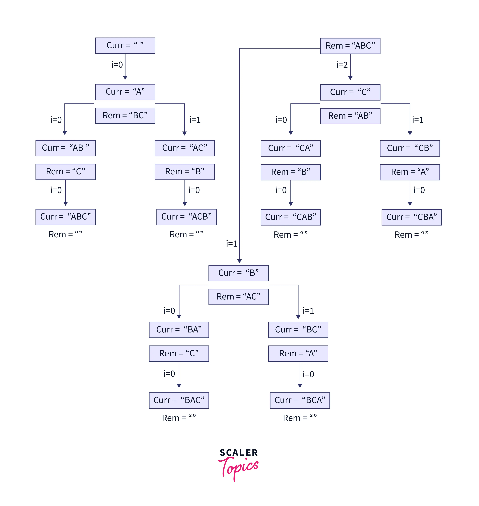

# Java Program to find all the permutations of a string

In this Java program, we have a recursion faith that the solve() function will calculate all the possible arrangements for the remaining characters of the string, and we are adding the current index character to the curr string. When the base condition is encountered where the length of the remaining string becomes 0, we will print the arrangement as a valid permutation.



### Java Code:
```java
public class Main {

    public static void solve(String curr, String rem) {
        if (rem.isEmpty()) { //Base condition for recursion
            System.out.println(curr);
            return;
        }
        for (int i = 0; i < rem.length(); i++) {
            //Rest of the string excluding the current index character
            String ros = rem.substring(0, i) + rem.substring(i + 1);
            //substring(f,s) function returns the string from index f to s-1 inclusive
            solve(curr + rem.charAt(i), ros);
            //recursive call by appending current index character in the curr string
            //and passing remaining of the string for further new arrangements
        }
    }

    public static void main(String[] args) {
        String str = "ABC";
        System.out.printf("The string '%s' has these permutations: \n", str);
        solve("", str);
    }
}

```
### Output:
```shell
The string 'ABC' has these permutations: 
ABC
ACB
BAC
BCA
CAB
CBA
```
